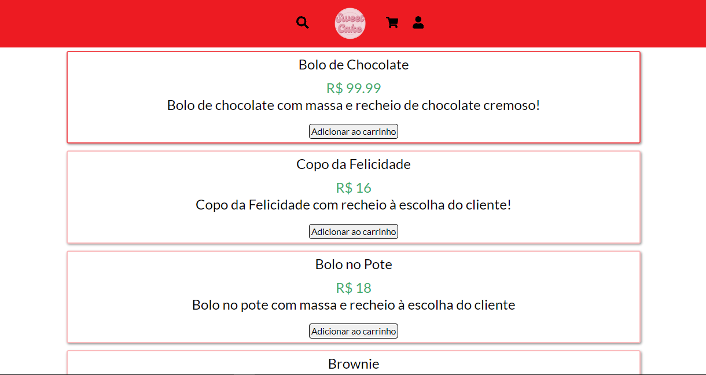

# Shop made with React and Node.js
  
 
 .
 ### Demo app: https://nk-shop-project.netlify.app
# About
 This project is a shop that let users create requests, manage items and use many more features.
 In order to use admin features, please use the following account: email: "admin@gmail.com", password: "12345".
 For the web page I used React and the API was made using Node.js.
 The authentication occurs on the middleware, using HTTPOnly Signed Cookies and JWT.
 The API makes the communication between the web page and the database that stores all the data.
 If you want to add or remove an item on the site, please, use moderately.

# Working on
 - [ ] Better UI
 - [ ] New sorting options

 # Used Tecnologies
  ### Back-end
  - JavaScript
  - Node.js
  - Express
  - Prisma
  - MySQL
  - Cookie-Parser
  - Bcrypt
  - JWT
  - CORS

  ### Front-end
  - React
  - JavaScript
  - Axios
  - JSX
  - CSS

  ### Implantation
  - Website: https://nk-shop-project.netlify.app
  - API: https://shop-project-hwt4.onrender.com (check project for routes)

  # Author
   Nicolas Klein Faria de Araujo  
   https://nk-portfolio-react.netlify.app
